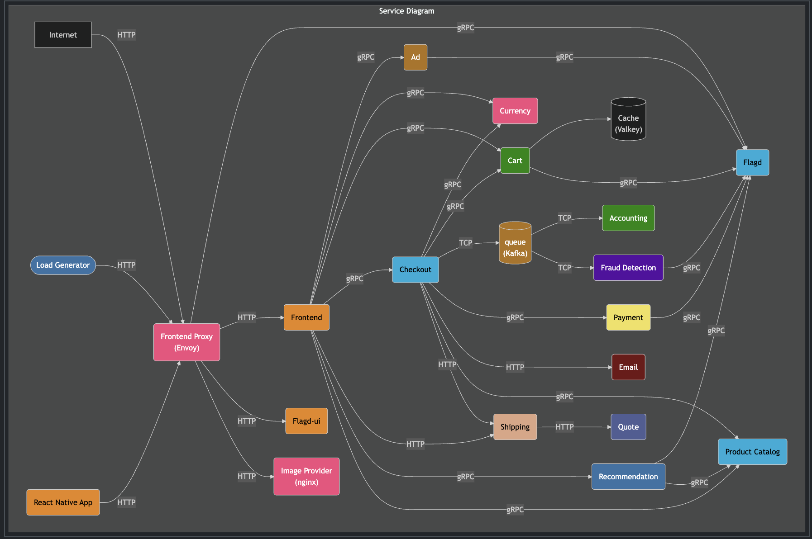

# 🛒 E-Commerce DevOps Implementation

This repository demonstrates a complete **DevOps implementation** on a **microservices-based E-Commerce application**.  
It is built by forking and extending the official [opentelemetry-demo](https://opentelemetry.io/docs/demo/architecture/?utm_source=chatgpt.com) project, adding modern DevOps tooling and practices for a **real-world production-like experience**.

---

## 📌 Project Overview

This project showcases:

- **Containerization** with Docker for all microservices
- **Container Orchestration** with Kubernetes (EKS on AWS)
- **Infrastructure as Code (IaC)** using Terraform for VPC, EKS, and networking components
- **Continuous Integration & Delivery (CI/CD)** with GitHub Actions and Argo CD
- **Cloud Integration** with AWS & Azure
- **Configuration Management** with Ansible
- **Custom Automation** with Shell and Python scripts
- **Observability & Tracing** with OpenTelemetry

It simulates a full-fledged **E-Commerce platform** with microservices such as Checkout, Cart, Payment, Shipping, Recommendation, Currency, Fraud Detection, and more.

---

## 📊 Architecture

High-level **Service Architecture**:

- **Frontend Proxy (Envoy)** exposes the services
- **Frontend + React Native App** for UI
- **Core Services**: Checkout, Cart, Payment, Shipping, Product Catalog, Recommendation
- **Supporting Services**: Currency, Ads, Accounting, Email, Fraud Detection, Quote
- **Infrastructure Services**: Kafka (Queue), Cache (Valkey), Feature Flags (Flagd), Image Provider
- **CI/CD Pipelines**: GitHub Actions → Argo CD → EKS Deployment


---

## 📂 Project Structure

```bash
ULTIMATE-DEVOPS-PROJECT-DEMO
├── .github/workflows       # CI/CD pipelines (GitHub Actions)
├── images                  # Architecture & diagrams
│   └── architecture.png    # Service diagram
├── internal                # Internal service configs
├── kubernetes              # K8s manifests & Helm charts
├── pb                      # Protobuf definitions
├── src                     # Source code for microservices
├── test                    # Test cases & integration tests
├── docker-compose.yml      # Local dev with Docker Compose
├── Makefile                # Automation tasks
├── buildkitd.toml          # BuildKit config
├── CONTRIBUTING.md         # Contribution guidelines
├── LICENSE                 # License file
└── ...
```

---

## 🚀 Features Implemented

✅ Multi-service E-Commerce demo app  
✅ Containerized microservices using Docker  
✅ Kubernetes deployment on AWS EKS  
✅ Terraform for IaC (VPC, EKS cluster, networking)  
✅ CI/CD pipeline with GitHub Actions → Argo CD → Kubernetes  
✅ AWS Cloud Integration with Route53 DNS & Load Balancers  
✅ Secure Frontend exposure mapped with custom domain  
✅ Monitoring & Tracing with OpenTelemetry  
✅ Automation with Ansible, Shell, and Python scripts  

---

## 🛠️ Tech Stack

**Infrastructure:** Terraform, AWS (EKS, VPC, Route53, ALB/NLB), Azure  
**Containerization:** Docker, Docker Compose  
**Orchestration:** Kubernetes (EKS)  
**CI/CD:** GitHub Actions, Argo CD  
**Config Management:** Ansible  
**Programming & Scripting:** Java (Microservices), Python, Shell  
**Observability:** OpenTelemetry, Envoy Proxy  
**Messaging & Caching:** Kafka, Valkey (Redis fork)  

---

## ⚙️ Setup & Deployment

1. **Clone Repository**
    ```bash
    git clone https://github.com/Eshwarsai-07/ultimate-devops-project-demo.git
    cd ultimate-devops-project-demo
    ```

2. **Local Development with Docker Compose**
    ```bash
    docker-compose up --build
    ```

3. **Provision Infrastructure (Terraform on AWS)**
    ```bash
    cd terraform/
    terraform init
    terraform apply
    ```

4. **Deploy to Kubernetes (EKS)**
    ```bash
    kubectl apply -f kubernetes/
    ```

5. **CI/CD Pipeline**
    - GitHub Actions triggers build & push of Docker images
    - Argo CD automatically syncs and deploys to EKS

---

## 📈 CI/CD Flow

- **GitHub Actions** → Builds microservices, runs tests, pushes images to registry
- **Argo CD** → Syncs with Kubernetes manifests and deploys updates to EKS
- **Terraform** → Manages AWS Infrastructure as Code

---

## 🌍 Observability

- Tracing & Metrics collected using OpenTelemetry
- Envoy Proxy handles service-to-service communication
- Centralized logs, metrics, and traces for better debugging

---

## 🙌 Acknowledgments

> Note: This project is a fork of opentelemetry-demo.  
> Thanks to the OpenTelemetry team and contributors for open-sourcing this amazing demo project. Definitely one of the best resources on